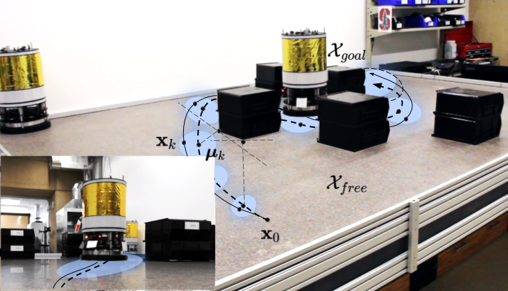

# Chance-Constrained Sequential Convex Programming

This repository accompanies our ECC 2020 paper *[Chance-constrained sequential convex programming for robust trajectory optimization](http://asl.stanford.edu/wp-content/papercite-data/pdf/Lew.Bonalli.Pavone.ECC20.pdf)*: an algorithm for uncertainty-aware trajectory planning.


<p align="center">
  
  <br /><em>Free-flyer robot avoiding obstacles despite uncertain dynamics.</em>
</p>


## Setup

Python 3.5.2 is required. It is advised to run the following commands within a virtual environment. 
```bash
	python -m venv ./venv
	source venv/bin/activate
```
Then, install the package as
```bash
	pip install -r requirements.txt
	pip install -e .
```

## Demo

We provide examples for an uncertain free-flyer system and for the *[Astrobee](https://ntrs.nasa.gov/archive/nasa/casi.ntrs.nasa.gov/20160007769.pdf)* robot navigating on-board the International Space Station.
```bash
	cd exps/
	python freeflyer_script.py
	python astrobee_script.py
```

## Citation

Please consider citing the corresponding publication if you use this work in an academic context:
```
@inproceedings{lew2020ccscp,
  title={Chance-Constrained Sequential Convex Programming for Robust Trajectory Optimization},
  author={Lew, Thomas and Bonalli, Riccardo and Pavone, Marco},
  booktitle={European Control Conference},
  year={2020}
}
```
